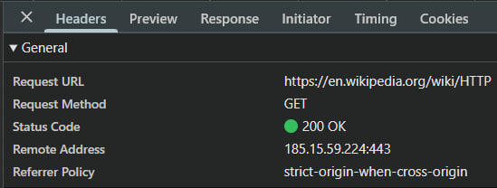
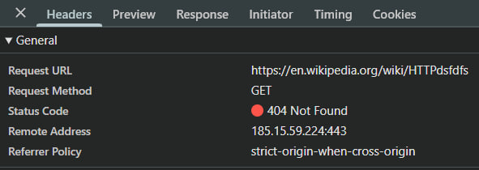
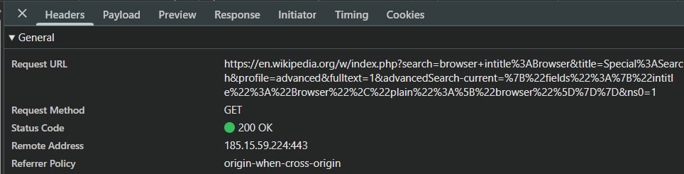

# Лабораторная работа №1. HTTP

## Цель работы:
*	Понять, что происходит, когда пользователь открывает сайт.
* Научиться находить и анализировать HTTP-запросы в браузере.
* Разобраться в назначении методов GET, POST, PUT, DELETE.

### Задание 1. Анализ HTTP-запросов. Часть 1

#### Практическая часть №1

* Открываем сайт [https://en.wikipedia.org/wiki/HTTP](https://en.wikipedia.org/wiki/HTTP). 
* Открываем инструменты разработчика в браузере.
* Переходим на вкладку *Network* и обновляем страницу. 

#### Изучаем следующие аспекты

* URL запроса: [https://en.wikipedia.org/wiki/HTTP](https://en.wikipedia.org/wiki/HTTP). 

  * Это адрес ресурса, к которому браузер отправил запрос.

* Метод запроса: GET

  * Метод GET применяется для получения содержимого ресурса.

* Статус ответа: 200 OK

  * Это означает, что страница загруженна корректно.
  * 200 запрос выполнен успешно.
  * OK сервер обработал запрос и отправил страницу.

* Заголовки запроса и ответа: 

   Запрос:

  * User-Agent — информация о браузере и системе
  * Accept — какие форматы может принять браузер.
  * Accept-Language — предпочтительный язык.
  * Referer — откуда был переход.
  * Cookie — данные сессии пользователя.

  Ответ:

  * Content-Type — тип содержимого.
  * Content-Encoding — способ сжатия.
  * Content-Length — размер ответа.
  * Cache-Control — правила кэширования.
  * Server — серверное ПО.
  * Strict-Transport-Security — защита HTTPS.
  * Set-Cookie — сервер устанавливает cookie.

* Есть ли тело запроса или ответа?: 

  * Тела запроса **нет**, так как GET не передает данные в теле.
  * Тело ответа **есть** - это HTML-код страницы. В нем содержиться:
    * разметка статьи
    * ссылки
    * изображения
    * скрипты

#### Какие еще запросы были отправлены при загрузке страницы и почему?

При открытие страницы так же отправляется запрос на:

* CSS-файлы (оформление)
* JavaScript-файлы (интерактивность)
* изображения
* шрифты

#### Скриншот с информацией о запросе.

#### Практическая часть №2

* Переходим по следующей ссылке [https://en.wikipedia.org/wiki/HTTPdsfdfs](https://en.wikipedia.org/wiki/HTTPdsfdfs) и повторяем анализ.

#### Изучаем следующие аспекты

* URL запроса: [https://en.wikipedia.org/wiki/HTTPdsfdfs](https://en.wikipedia.org/wiki/HTTPdsfdfs). 

  * Это адрес ресурса, к которому браузер отправил запрос, но такой страницы **не существует**.

* Метод запроса: GET

* Статус ответа: 404 Not Found

  * Это означает, что такого адреса не существует.
  * 400 сервер не нашел запрашиваемый ресурс.
  * Not Found страницы не существет.
  * Причина: Запрошенный URL не существует на сервере, поэтому сервер вернул ошибку «ресурс не найден».

* Заголовки запроса и ответа: 

   Запрос:

  * method - тип запроса.
  * path - путь к ресурсу.
  * User-Agent — информация о браузере.
  * Accept — какие форматы принимает браузер.
  * Accept-Language — предпочтительные языки.
  * Referer — откуда был переход.
  * Cookie — данные сессии.
  * Cache-Control — управление кэшем.

  Ответ:

  * Content-Type — тип содержимого.
  * Content-Length — размер страницы ошибки.
  * Server — серверное ПО.
  * Date — дата ответа.

* Есть ли тело запроса или ответа?: 

  * Тела запроса **нет**, так как GET не передает данные в теле.
  * Тело ответа **есть**. Сервер отправляет страницу с сообщением об ошибке.

#### Какие еще запросы были отправлены при загрузке страницы и почему?

При открытие страницы так же отправляется запрос на:

* CSS-файлы 
* JavaScript-файлы 
* изображения
* шрифты

### Задание 2. Анализ HTTP-запросов. Часть 2

* Переходим на ссылку [https://en.wikipedia.org/wiki/Special:Search](https://en.wikipedia.org/wiki/Special:Search) и выполняем поиск по слову *browser*. 
* Переходим в *Network*.

#### Изучаем следующие аспекты.

* URL запроса: [https://en.wikipedia.org/wiki/Special:Search](https://en.wikipedia.org/wiki/Special:Search)

* Метод запроса: GET
  * Метод GET используется потому что:
    * поиск - это получение информации.
    * данные передаются через URL.
    * Параметры видны в адресной строке.
    * Серверу не нужно сохранять данные.

* Query Parameters: После ? идут параметры:

  * **search=browser+intitle%3ABrowser**
    * Он означает:Искать статьи со словом browser(ключевое слово) и Browser(intitle:Browser — искать слово Browser в заголовке статьи) в названии.

  * **title=Special%3ASearch**
    * Это указывает системе, что используется страница поиска.

  * **profile=advanced**
    * Используется расширенный поиск.

  * **fulltext=1**
    * Включён поиск по полному тексту статей.

  * **advancedSearch-current=...**
    * Он хранит параметры расширенного поиска.

  * **ns0=1**
    * Означает искать только среди обычных статей.

* Статус ответа:

  * 200 OK

* Тело запроса и ответа:

  * У запроса нет тела. Все данные передаются через URL.

  * В ответе есть тело. HTML-страница с результатами поиска.

### ЗЗадание 3. Анализ HTTP-запросов. Часть 3

* Повторяем анализ HTTP-запроса для сайта [https://www.youtube.com](https://www.youtube.com).

#### Изучаем следующие аспекты.

* URL запроса: [https://www.youtube.com](https://www.youtube.com).

* Метод запроса: GET

* Статус ответа: 200 OK (from service worker)
  * from service worker - ответ был получен не напрямую с сервера, а через сервир Worker. 
  * Servise Worker - кэширует ресурсы, ускоряет загрузку,позволяет сайту работать быстрее.

* Заголовки ответа:

  * Content-Type
  * Cache-Control - запрещает кэширование страницы.
  * Strict-Transport-Security - принудительное использование HTTPS.
  * Content-Security-Policy - это защита от XSS-атак.
  * X-Content-Type-Options - запрещает браузеру угадывать тип контента.
  * X-Frame-Options - запрещает встраивание страницы в iframe на других сайтах.

* Заголовки запроса:

  * User-Agent — информация о браузере и системе.
  * Accept — какие форматы принимает браузер.
  * Accept-Encoding — поддержка сжатия.
  * Accept-Language — языковые предпочтения.
  * Referer — откуда был переход.
  * sec-ch-ua — информация о браузере.
 
* Тело запроса и ответа:

  * тело запроса отсутсвует.
  * тело ответа есть.

* Какие еще запросы?
  * JavaScript-файлы
  * CSS
  * изображения
  * шрифты
  * API-запросы
  * рекламные запросы
  * видео-метаданные

**YouTube** - это динамическое SPA-приложение.

### Задание 4. Составление HTTP-запросов

Задача состоит в том, что нужно:
1. составить GET-запрос к серверу по адресу http://sandbox.usm.com, указав в заголовке User-Agent свое имя и фамилию.

`GET / HTTP/1.1`

`Host: sandbox.usm.com`

`User-Agent: Ghitu Daria`

*User-Agent* - это HTTP-заголовок, который передвет серверу информацию о клиенте, отправляющем запрос. Используется для определения типа клиента, адаптации содержимого под устройство, анализа статистики посещений, фильрации ботов.

2. Составить POST-запрос к серверу по адресу http://sandbox.usm.com/cars, указав в теле запроса следующие параметры:

`POST /cars HTTP/1.1`

`Host: sandbox.usm.com`

`User-Agent: Ghitu Daria`

`Content-Type: application/`

`x-www-form-urlencoded`

`Content-Length: 34`

`make=Toyota&model=Corolla&year=2020`

* Метод POST используется для отправки данных серверу.

* В теле запроса передаются параметры автомобиля.

* Content-Type указывает формат передаваемых данных.

* Content-Length указывает размер тела запроса.

* **Какие еще методы HTTP существуют?**

|  Метод  |  Назначние  |
|---------|-------------|
|GET|Получение данных|
|POST|Создание ресурса|
|PUT|Полное обновление ресурса|
|PATCH|Частичное обновление ресурса|
|DELETE|Удаление ресурса|
|HEAD|Получение только заголовка|
|OPTIONS|Получение списка поддерживаемых методов|

3. Составить PUT-запрос к серверу по адресу http://sandbox.usm.com/cars/1, указав в заголовке User-Agent свое имя и фамилию, в заголовке Content-Type значение application/json и в теле запроса параметры.

`PUT /cars/1 HTTP/1.1`

`Host: sandbox.usm.com`

`User-Agent: Иван Иванов`

`Content-Type: application/json`

`Content-Length: 62`

`{`

 `"make": "Toyota",`

 `"model": "Corolla",`

 `"year": 2021`

`}`

* Метод PUT используется для полного обновления ресурса.

* В данном случае обновляется автомобиль с идентификатором 1.

* Content-Type: application/json указывает, что данные передаются в формате JSON.

* В теле запроса передаётся новый объект автомобиля.

* **Разница между PUT и PATCH**

|PUT|PATCH|
|---|-----|
|Полностью заменяет ресурс|Частично обновляет ресурс|
|Требует передачу всего объекта|Передаются только изменённые поля|

[def]: images\Запрос3.jpg
[def2]: images\Запрос2.jpg
[def3]: images\Запрос1.jpg
